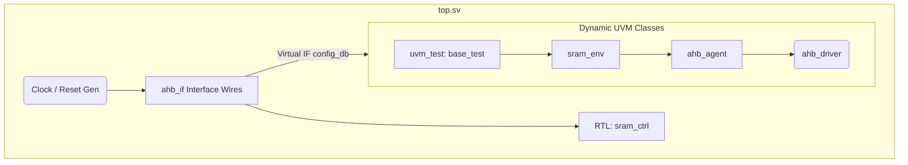

# Testbench Top Directory

This directory acts as the entry point and foundational structure for the UVM testbench. It contains the top-level testbench module which connects the Design Under Test (DUT) to the UVM framework.

## Files Overview

### `top.sv`
**Purpose**: Top-level SystemVerilog module that wraps the entire Simulation hierarchy.
**Logic Breakdown**:
- **Clock and Reset Generation**: Uses initial and forever blocks to synthesize a 100MHz clock (`hclk`) and coordinate the active-low reset sequence (`hresetn` transitions from low to high at 20ns).
- **Interface Instantiation**: Creates an instance of the `ahb_if` physical wires (the pin connector).
- **DUT Instantiation**: Hard-wires the signals from `ahb_if` to the ports of the `sram_ctrl` (the actual design logic being tested). Extracts internal signals like `bank_sel` and `sram_en` to provide testbench visibility for power verification.
- **UVM Configuration Database**: Leverages `uvm_config_db` to pass the virtual interface (`virtual ahb_if`) into the UVM configuration space. This critical step enables the UVM agents, drivers, and monitors (which exist in abstract classes) to manipulate physical wires in the simulator.
- **Test Invocation**: Executes `run_test()`, which parses the `+UVM_TESTNAME=` command-line argument to construct and run the specified test case dynamically.

## High-Level Topology Diagram

