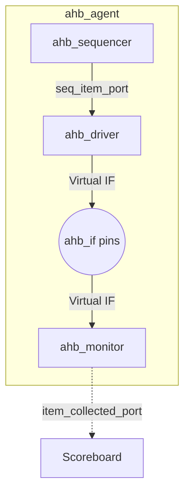

# UVM Agents Directory

This directory contains the AHB UVM Agent and everything required to assemble it. The agent is responsible for translating abstract `uvm_sequence_items` (transactions) into physical pin wiggles on the bus, and conversely, monitoring the physical bus to recreate transactions for analysis.

## Files Overview

### `ahb_transaction.sv`
**Purpose**: Defines the data structure for an AHB operation.
**Logic Breakdown**:
- Contains standard randomizable properties like `haddr`, `hrdata`, `hsize`, `hwrite`, and `hwrdata`.
- **Constraints**: Enforces legal states. E.g., limits memory accesses to the 64KB range (`haddr < 32'h10000`) and enforces strict memory-alignment rules. (e.g., 32-bit transfers must be 4-byte aligned).

### `ahb_sequencer.sv`
**Purpose**: The traffic controller.
**Logic Breakdown**:
- A parameterization of `uvm_sequencer` configured to process `ahb_transaction` objects. It is the bridge deciding which sequences from the test are allowed to feed transactions to the driver.

### `ahb_driver.sv`
**Purpose**: Converts logical testbench transactions to physical hardware signals.
**Logic Breakdown**:
- **Interface Interaction**: Uses a virtual interface (`vif`) connecting to `ahb_if`.
- Follows the stringent pipelined AHB timing:
  1. **Address Phase**: Places constraints and addresses on the bus (`haddr`, `hwrite`, etc.) synchronously with the clock.
  2. **Data Phase**: Depending on the transaction direction, it either waits and latches read data from the system, or drives the `hwdata` to memory. Includes precise settling cycles to handle `sram_model` zero-wait-state combinational reads cleanly.

### `ahb_monitor.sv`
**Purpose**: Passively observes the AHB interface without intruding.
**Logic Breakdown**:
- Scans every clock edge looking for valid selections (`hsel && htrans == NONSEQ`).
- Once a transaction is detected, it spawns an observer task (`capture_data_phase`) to latch data at the correct pipeline phase.
- Acts as a secondary Coverage Collector by sampling a `covergroup` (`ahb_cov`) on address, size, and direction.
- Records real-time low-power behavior checks (`LOW_PWR_MON`), analyzing active byte lane conditions directly from the pins.

### `ahb_agent.sv`
**Purpose**: Organizes the components within this folder into a reusable IP agent.
**Logic Breakdown**:
- Based on `uvm_active_passive_enum`, it builds and seamlessly connects the Driver and Sequencer if the agent is marked as `UVM_ACTIVE`. The Monitor is instantiated regardless of configuration.

### `ahb_agents_pkg.sv`
**Purpose**: Container File.
**Logic Breakdown**:
- Bundles all individual SV files above into a single SystemVerilog Package scope, resolving dependencies and compilation order.

## UVM Agent Diagram

