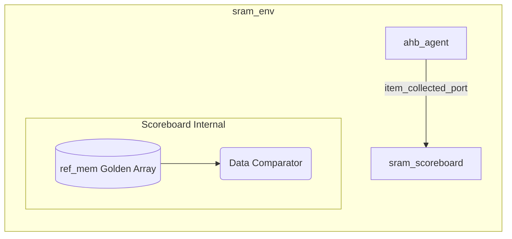

# UVM Environment Directory

This directory defines the UVM Environment and Scoreboard. The environment acts as the structural foundation for the testbench, collecting multiple agents and dynamic scoreboarding algorithms into one unified container.

## Files Overview

### `sram_scoreboard.sv`
**Purpose**: Evaluates functional correctness independently from RTL operations.
**Logic Breakdown**:
- Operates via an `uvm_analysis_imp` port that receives transactions extracted by the `ahb_monitor`.
- **Golden Reference Model**: Implements a precise 64KB internal memory array (`ref_mem`), emulating identical behavior to what the hardware _should_ do.
- **Verification Logic**:
  - When seeing a **Write** transaction, the scoreboard splits the `hwdata` string according to `hsize` into appropriate byte-lane writes within `ref_mem`.
  - When seeing a **Read** transaction, the scoreboard reconstructs proper expected data bytes using `ref_mem`, handles AHB byte lane shifts computationally, and stringently compares it against the `tr.hrdata`.
- Posts `[SCB_MATCH]` on success or fatal `[SCB_MISMATCH]` errors alerting the test.

### `sram_env.sv`
**Purpose**: Top-level macro component combining the framework pieces.
**Logic Breakdown**:
- Extends `uvm_env` and orchestrates instantiation of major verfication blocks via `build_phase`.
- Generates `ahb_agent` and `sram_scoreboard`.
- **Connect Phase**: Most importantly, connects the analysis port on the agent's monitor directly to the scoreboard `item_collected_export`. This is the fundamental plumbing wire passing operations back and forth.

### `sram_env_pkg.sv`
**Purpose**: Package inclusion file.
**Logic Breakdown**:
- Connects macro and IP structures, packaging `sram_scoreboard` and `sram_env` so tests can just import the environment globally.

## Environment Architecture

