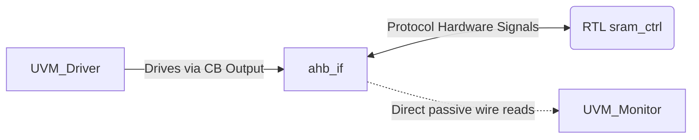

# UVM Interfaces Directory

This directory defines structurally how physical signals move between modules and SystemVerilog testbench boundaries.

## Files Overview

### `ahb_if.sv`
**Purpose**: Physical wrapper forming the digital pipeline between DUT and Testbench.
**Logic Breakdown**:
- **Signals Definition**: Contains standard AHB protocol variables such as `haddr`, `hwrite`, `hwdata`, `hrdata`, and state controls like `hsel` and `htrans`.
- **Custom Hardware Probing**: Connects low-power implementation signals (`bank_sel`, `sram_en`) extracted strictly for the testbench to verify RTL implementations functionally.
- **Clocking Definitions (`clocking cb`)**: Manages how the driver connects securely without race conditions. Crucially isolates driver `outputs` from the monitor's unskewed `input` monitoring, effectively resolving advanced pipeline skew issues occurring during reset or combinational timing. 

## Interface Wiring Logic

